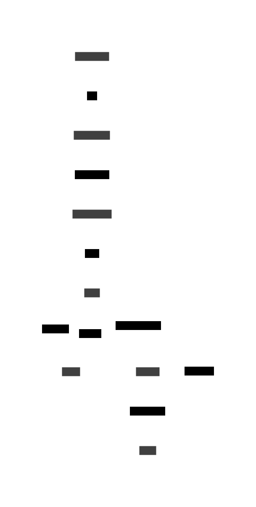
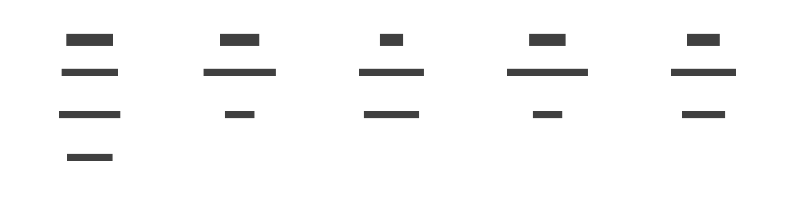
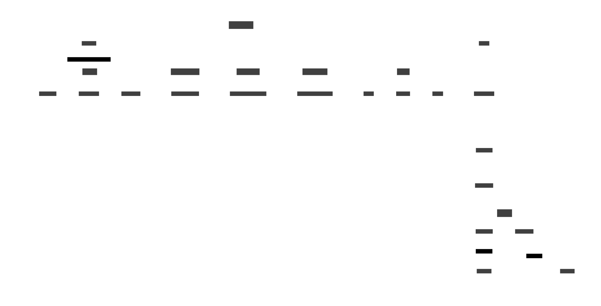
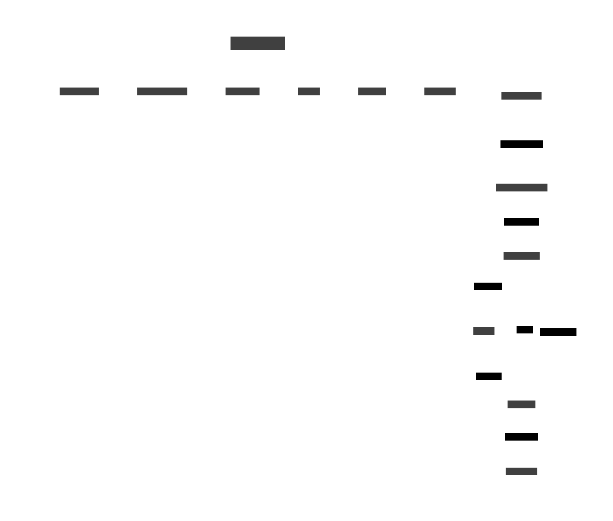
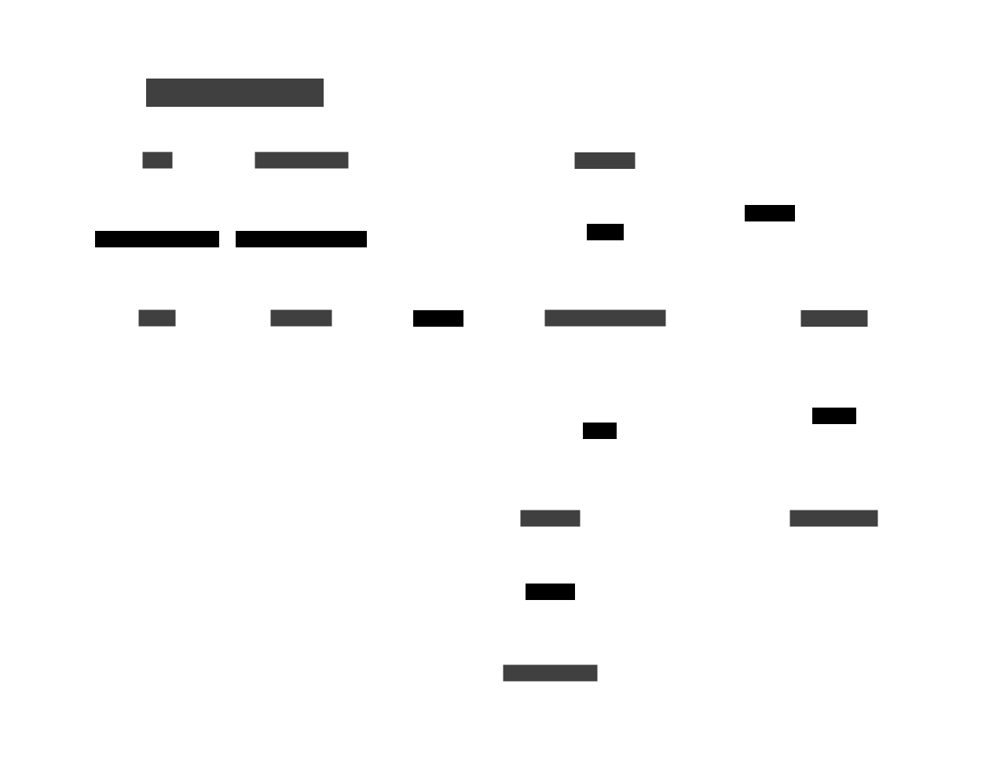
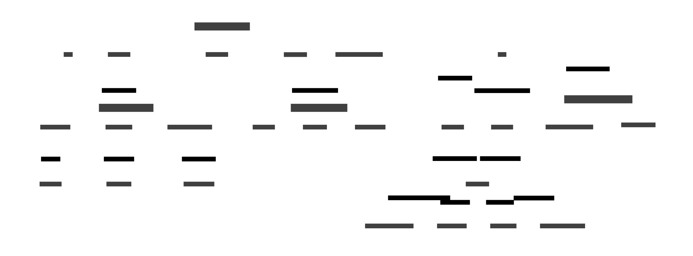
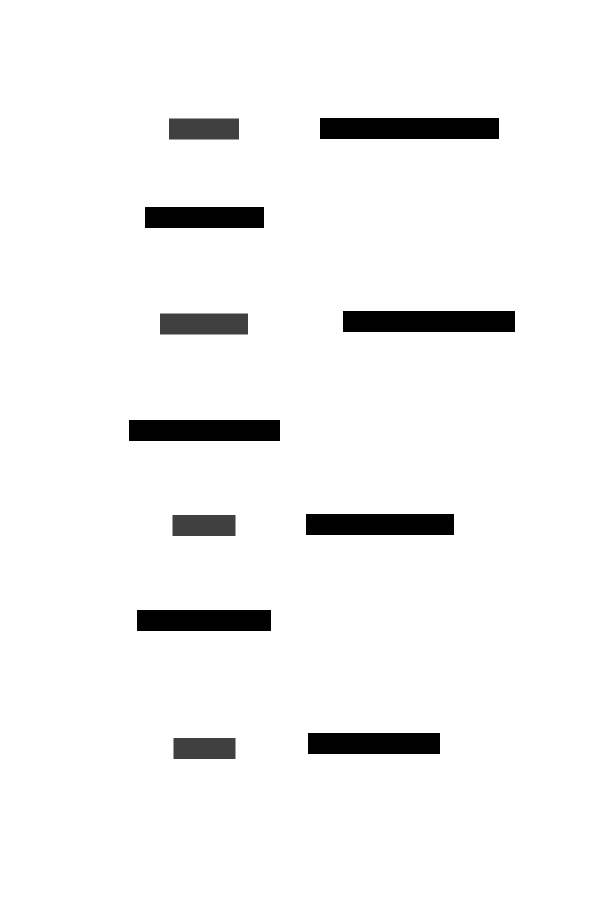
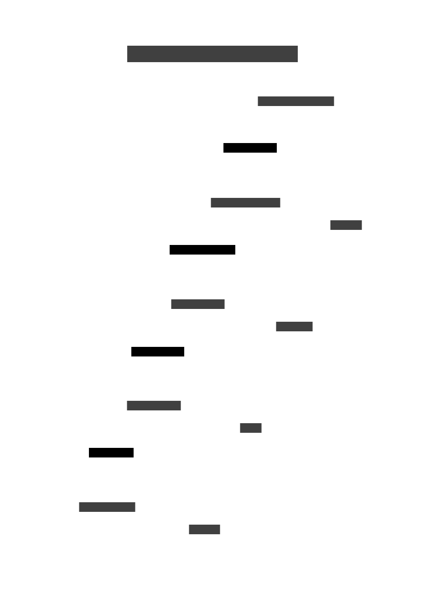

Takes a concept and renders a diagram. Check out the `svgs` folder for some of the rendered diagrams, the file names are the concepts that were provided to the LLM.

[Walkthrough Video](https://www.loom.com/share/f3acbbec1d2f431db142225e2d954ba0?sid=f7fe01a6-efbe-44b4-a2f6-5166c6c969e2)

# Image Gallery

**How a pencil is made**

**Bake Cookies**

**Conception Till Birth For Humans**

**Doing Your Nails**

**Electricity**

**How data gets sent from one packet to another on the internet**

**How llms are trained**

**Meditation**

**Quantum Computing**

**React Virtual DOM Diffing Algorithm**

**RAG**

**Sequence of start up creation to IPO**

**Courtship to marriage in the united states**

**US Presidential election process**

**Water cycle**

